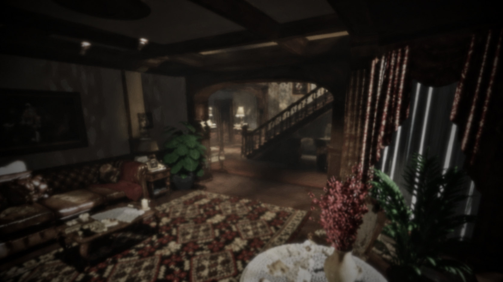

# The Last Visit

*A short first-person narrative experience created for LEVEL ZERO, Silico Battles Inter-School Competition.*

## Overview

The Last Visit is a narrative exploration game set inside a childhood home that is about to be cleared out.

The player returns to the house one final time and slowly reconnects with the memories it holds. Through ordinary objects left behind throughout the home, the game tells a quiet story about memory, loss, time, and the moments people often fail to appreciate until they are gone.

## Experience

- Explore a realistic and atmospheric home environment.
- Interact with meaningful household objects.
- Discover five memories through environmental storytelling.
- Experience a focused first-person narrative with a beginning and ending.
- Progress through the story using a simple objective system.

## Theme

This project is inspired by the competition theme **Memento Mori**.

Rather than presenting death directly, The Last Visit explores the theme through the passage of time, the memories attached to familiar places, and the traces people leave behind. The game is intended to remind players that ordinary moments and relationships can become important memories before we realise it.

## Development

The project was developed using:

- Roblox Studio
- Blender
- Rojo
- Visual Studio Code
- Git and GitHub

The environment, lighting, player experience, narrative systems, interactions, and optimization were developed throughout the competition.

## Credits

Developed by **Team Flow** for the **Silico Battles Inter-School Competition, LEVEL ZERO**.
